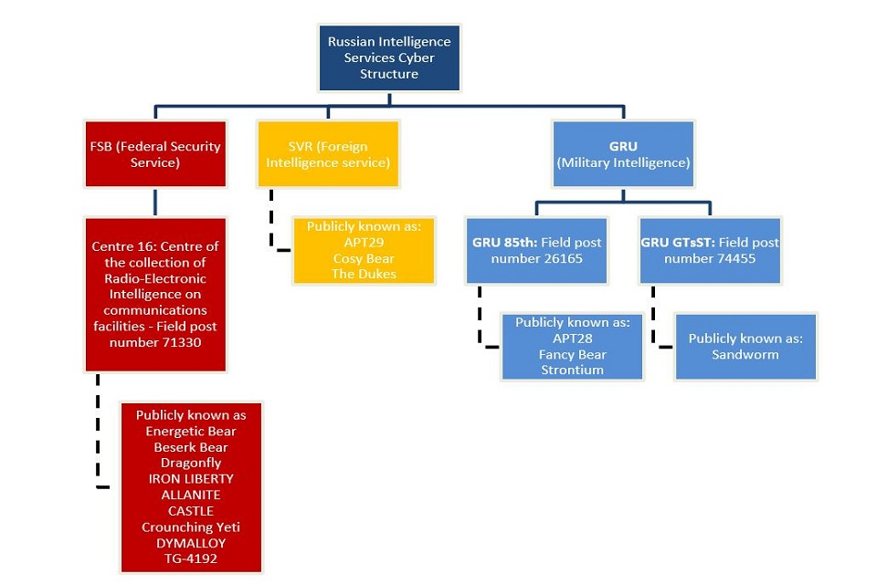
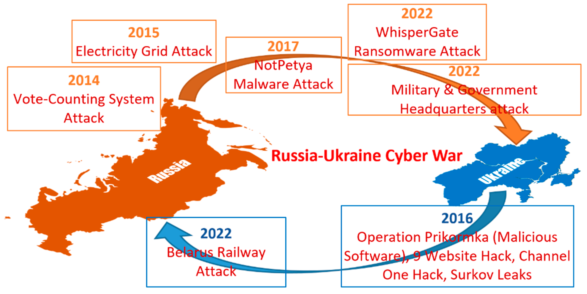
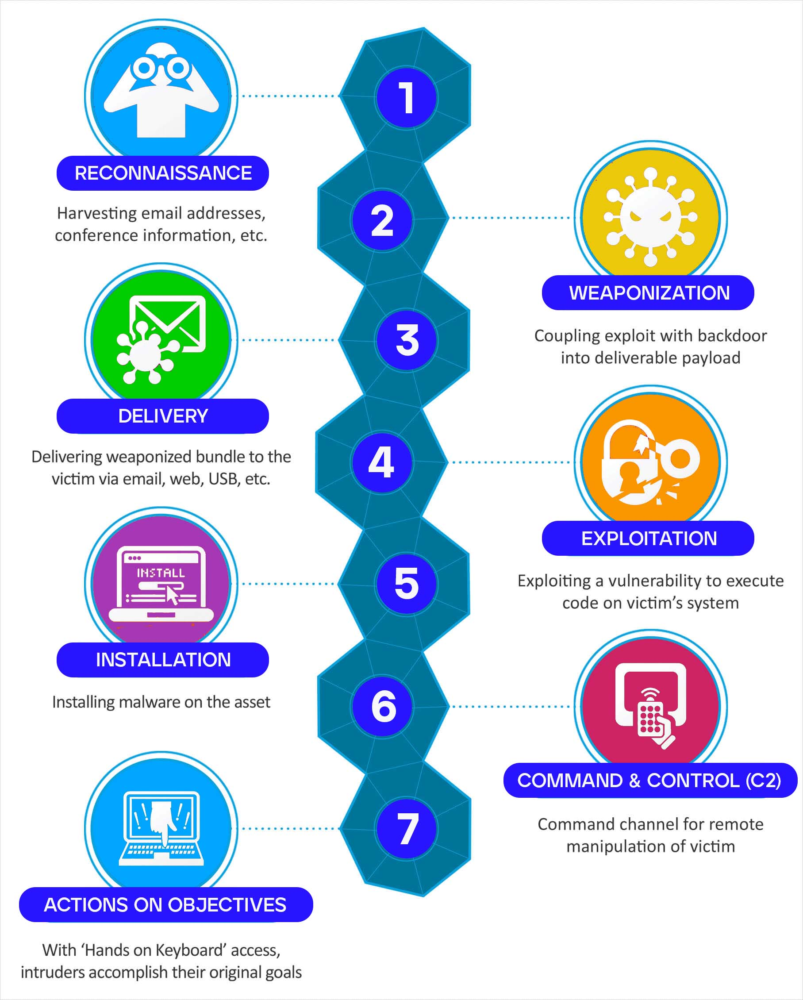
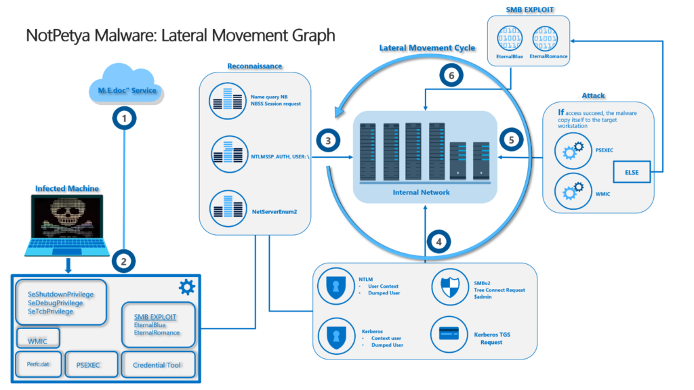
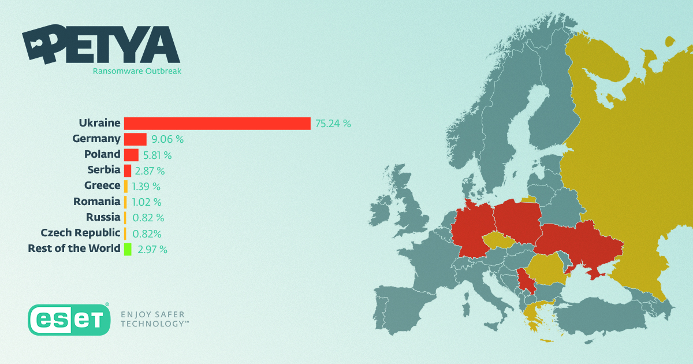

# NotPetya: A Cyberweapon in the Russia–Ukraine Conflict

## Research
- Conducted and Compiled by 
  ##### Anas Malik
  ##### Student at FAST Lahore

## Abstract
- NotPetya appeared in June 2017 as ransomware but was a destructive wiper.
- Primarily targeted Ukraine but spread globally via software supply chain.
- Caused over $10 billion in damages; attributed to Russian GRU’s Sandworm group.

## Background
  ### Organizational Map of Russian APT Groups
  - A visual showing Russian APT groups like Sandworm, Fancy Bear, APT28, with lines connecting them to the GRU or FSB.
  
 > 📌
 > 

  ### Timeline of Russian Cyber Attacks on Ukraine
  - A horizontal timeline showing major cyber incidents e.g. 
  - 2014 Crimea annexation, 2015/2016 power grid attacks, 2017 NotPetya, 2022 invasion-related attacks.
  
 > 📌
 > 

 ###  Cyber Attack Lifecycle 
 - This lifecycle which must be studied was used in each of cyber attacks and programs conducted by GRU units incuding SandWorm
  
 > 📌
 > 

## Introduction
- Occurred during Russia–Ukraine tensions (eve of Ukraine’s Constitution Day).
- Delivered via compromised Ukrainian tax software “M.E.Doc.”
- Named Sandworm due to Dune references in code.

## Attack Overview
- **Initial vector:** Backdoor in M.E.Doc from earlier phishing & human error.
- **Tools used:**
  - Mimikatz for credential harvesting.
  - EternalBlue & EternalRomance (NSA exploits) for lateral movement.
- **Payload:** Encrypts Master Boot Record (MBR); shows fake ransom note.
- **Kill-switch:** Checks for file `perfc.dat` to avoid re-infection.

>📌
> 
> *Diagram showing attack flow and process chain from M.E.Doc → LAN via exploits.*

## Global Impact
- Hit major companies: Maersk, Merck, FedEx, etc.
- Maersk: 76 ports impacted; estimated $300M loss.
- Estimated global losses exceeded $10B.
- No real decryption mechanism = destruction, not ransom.

> 📌 
>  
> *Statistics showing global NotPetya spread.*

## CIA Triad Impact
- **Confidentiality:** Largely unaffected (no data theft publically found but who knows what they got).
- **Integrity:** Destroyed via disk encryption and system damage.
- **Availability:** 
  - Paralyzed systems and operations globally.
  - Including internation companies and vendor issues

> 📌
> 
> CIA Triad diagram with "Integrity" and "Availability" highlighted.*

## Security Failures
- **Human error:** No training on determining phishing emails led to initial compromise.
- **Patch management:** Many systems unpatched despite known exploits.
- **Network segmentation:** Absent or weak, enabling rapid spread.
- **Backup & IR plans:** Inadequate for rapid, destructive malware.
- **Compliance gaps:** Lack of adherence to ISO/NIST controls.

## Lessons Learned
- Always vet & secure supply-chain software.
- Patch critical systems regularly (especially legacy).
- Enforce MFA and remove shared admin credentials.
- Use strong segmentation to contain malware spread.
- Maintain and test offline backups.

## References
1. A. Greenberg, “The Untold Story of NotPetya,” *WIRED*, 2018.  
2. Lloyd’s Futureset, “Illuminating Cyber Risk,” 2018.  
3. Portnox Blog, “A Closer Look at NotPetya,” 2023.  
4. D. Bisson, “NotPetya Timeline,” *Tripwire*, 2017.  
5. Columbia SIPA Case Study, “NotPetya,” 2022.

